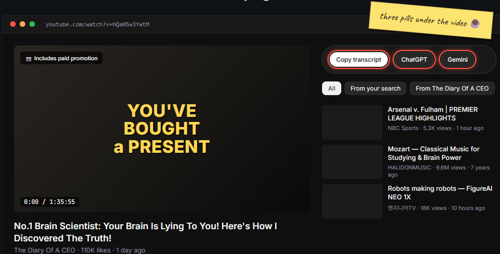

# YouTube → AI (transcript handoff)

A tiny Chrome / Brave extension that adds **three buttons** at the top of every YouTube video's right column:

- **Copy transcript** — full text of the video, on your clipboard.
- **ChatGPT** — opens ChatGPT in a new tab with the transcript already pasted and a "summarize this" prompt.
- **Gemini** — same thing, but Gemini.



> 📊 **Visual walkthrough:** **[vascode2.github.io/yt-transcript-to-ai](https://vascode2.github.io/yt-transcript-to-ai/)** — a one-page dashboard that shows what it does and how it works.

---

## Install (one minute)

1. Download / clone this repo.
2. Open `chrome://extensions` (or `brave://extensions`).
3. Turn on **Developer mode** (top-right).
4. Click **Load unpacked** → pick the `extension/` folder.

That's it. Open any YouTube video — the three buttons appear above "In this video" on the right.

> **Tip:** **Ctrl/⌘+click** (or middle-click) **ChatGPT** or **Gemini** to open the AI tab in the background, so you don't lose your spot on YouTube.

---

## When a video doesn't work

Sometimes YouTube doesn't expose the transcript right away. The fix takes 5 seconds:

1. Click the **⋮** (more) menu under the video title → **Show transcript**.
2. Wait until lines appear in the side panel.
3. Click **Copy transcript** in the toolbar again.

Opening YouTube's own transcript wakes up the data the extension reads. If it still fails, the video probably doesn't have captions (livestreams, music videos, very new uploads).

---

## Requirements

**Chrome** or **Brave** (any Chromium browser). Works on **macOS, Windows, and Linux** — it's browser-specific, not OS-specific.

---

<details>
<summary><b>Permissions, in plain English</b></summary>

| Permission | Why |
|---|---|
| Host: `youtube.com` | Read the video's captions and mount the toolbar. |
| Host: `chatgpt.com`, `gemini.google.com` | Paste the transcript into the chat box on those sites. |
| `scripting` | Same — needed to drop the prompt into the AI's composer. |
| `storage` | Briefly holds the prompt while the AI tab opens. |

No analytics, no tracking, no remote server. Everything runs in your browser.

</details>

<details>
<summary><b>How it works (for the curious)</b></summary>

When the toolbar mounts, it **prefetches** the transcript in the background, so by the time you click **Copy** the text is already in memory and the click completes in ~30 ms. (Chrome only honors a recent user click for ~5 seconds when writing to the clipboard, which is why earlier versions sometimes failed on slow fetches.)

The transcript is sourced in three tiers — the extension tries each in order:

1. The video's `timedtext` URL exposed in the player JSON.
2. The InnerTube `get_transcript` endpoint.
3. Scraping YouTube's own transcript side-panel.

For ChatGPT and Gemini, the prompt is dropped straight into the chat composer via `chrome.scripting`. URLs have a few-KB length limit; a real transcript is tens of KB, so the URL approach doesn't work for long videos.

Source: [`extension/content.js`](extension/content.js).

</details>

<details>
<summary><b>Run the test suite</b></summary>

Headed Playwright test that loads the extension, opens a regression URL, clicks **Copy transcript**, and fails unless the status reads **Copied**.

```powershell
npm install
npm run test:e2e                  # uses Brave if found, else Playwright Chromium
npm run e2e:chromium              # force Playwright's Chromium
```

For repeated reproductions:

```powershell
.\scripts\copy-flake-loop.ps1 -Runs 10 -Url '<youtube-url>'
```

</details>

<details>
<summary><b>Optional: localhost summarizer (advanced)</b></summary>

A small Node app (`server.js`) that takes a YouTube URL, downloads captions with `yt-dlp` outside the browser, and renders a summary + key points. Useful as a fallback when the in-browser path fails.

```powershell
python -m pip install --user yt-dlp
node server.js
```

Open <http://localhost:3000>.

**Summary providers** (in order of preference): OpenAI → Gemini → Ollama → built-in quick extract. Each runs only if the previous didn't produce a summary.

| Provider | Cost | Setup |
|---|---|---|
| **Quick extract** | Free | None — built in |
| **Ollama** | Free, local | `ollama pull llama3.2`, set `$env:OLLAMA_MODEL` |
| **LM Studio** | Free, local | Set `OPENAI_BASE_URL=http://localhost:1234/v1` |
| **Gemini API** | Free tier | Set `GEMINI_API_KEY` from [Google AI Studio](https://aistudio.google.com/) |
| **OpenAI API** | Paid | Set `OPENAI_API_KEY` |

Knobs: `GEMINI_SUMMARY_MODEL`, `OPENAI_SUMMARY_MODEL`, `OLLAMA_MODEL`, `OPENAI_BASE_URL`, `OPENAI_DISABLE_JSON_MODE`, plus chunk-size variables.

Requirements for this part: **Node.js 18+** and **Python with `yt-dlp`**.

</details>
